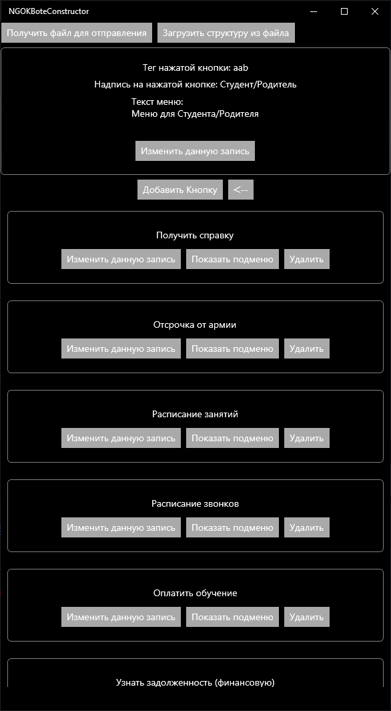
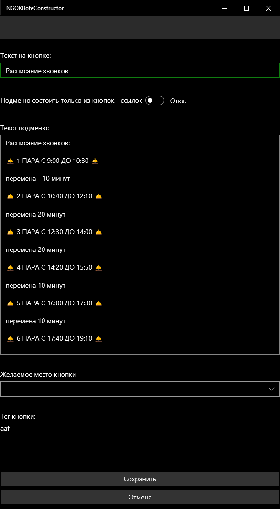

# NGOKBoteConstructor
Инструмент для визуального проектирования и управления структурой меню конкретного Telegram-бота. Позволяет изменять логику переходов и контент кнопок без внесения изменений в исходный код серверной части.

## Описание
Проект представляет собой специализированный визуальный редактор, разработанный на платформе .NET. Система позволяет выстраивать иерархию меню, настраивать навигационные кнопки и внешние ссылки.
Результатом работы конструктора является конфигурационный файл в формате JSON, который при передаче целевому боту (через сообщение в консоль или боту) обновляет его интерфейс.
Ключевой функционал

* Визуальное моделирование: Отображение структуры меню бота.
* Экспорт конфигурации: Генерация JSON-объекта для синхронизации с базой данных бота.
* Гибкость: Устранение необходимости в жестком кодировании (hardcode) структуры меню.

## Технологический стек

* Framework: .NET
* Формат данных: JSON

Интерфейс
| Визуализация структуры меню| Настройка параметров кнопок (меню) |
|---|---|
||  |

Текущий статус
Проект находится в состоянии архивного хранения.

* Внимание: Запуск автономной версии приложения в текущий момент невозможен.
* Система была разработана под конкретную реализацию Telegram-бота и передана заказчику.

---
# Личное впечатление 
Крайне не советую использовать Xamarin, а именно его UWP-реализацию для локальных проектов. 
Требуется создание сертификатов, у которых ограничен срок действия.
Скомпилировать проект дает только в файл с расширением .appx вместо стандартного .exe. Установка через отдельный установщик часто блокируется даже после добавления сертификата в доверенные.
На ПК заказчика удалось поставить приложение (в год разработки), сейчас же пришлось устанавливать через PowerShell. 
Плюс ко всему, Xamarin сам по себе уже не актуален.
